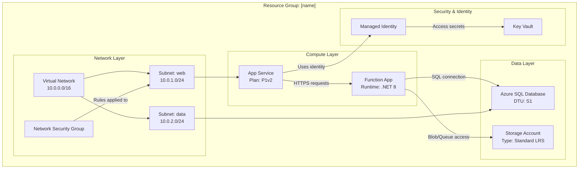

# Azure Resource Visualizer - アーキテクチャ図ジェネレーター

ユーザーは、個々のリソースがどのように組み合わさるかの理解や、関係を示す図の作成を求めることがあります。このSkillの使命は、Azure リソース グループを調査し、その構造と関係を理解して、アーキテクチャを明確に示す包括的な Mermaid 図を生成することです。

## 主な責務

1. **リソース グループの検出**: 指定されていない場合は、利用可能なリソース グループを一覧表示する
2. **リソースの詳細分析**: すべてのリソース、その構成、相互依存関係を調査する
3. **関係のマッピング**: リソース間のすべての接続を特定して文書化する
4. **図の生成**: 詳細で正確な Mermaid 図を作成する
5. **ドキュメントの作成**: 図を埋め込んだ明確な Markdown ファイルを作成する

## ワークフロー

### Step 1: リソース グループを選択する

ユーザーがリソース グループを指定していない場合:

1. ツールを使って利用可能なリソース グループを検索する。ツールがない場合は `az` を使用する。
2. リソース グループとその場所を番号付きで一覧表示する
3. 番号または名前で選択するようユーザーに求める
4. ユーザーの応答を待ってから進める

リソース グループが指定されている場合は、存在を検証して進めます。

### Step 2: リソースを検出して分析する

リソース グループが決まったら:

1. Azure MCP tools または `az` を使って、リソース グループ内の **すべてのリソースを検索**する。
2. **各リソースを分析**し、次の情報を取得する:
   - リソース名と種類
   - SKU/レベル情報
   - 場所/リージョン
   - 主要な構成プロパティ
   - ネットワーク設定（VNet、サブネット、プライベート エンドポイント）
   - ID とアクセス（Managed Identity、RBAC）
   - 依存関係と接続

3. 次の関係を特定して **マッピング**する:
   - **ネットワーク接続**: VNet ピアリング、サブネットの割り当て、NSG ルール、プライベート エンドポイント
   - **データ フロー**: Apps → Databases、Functions → Storage、API Management → Backends
   - **ID**: リソースに接続するマネージド ID
   - **構成**: Key Vault を参照する App Settings、接続文字列
   - **依存関係**: 親子関係、必要なリソース

### Step 3: 図を構築する

`graph TB`（上から下）または `graph LR`（左から右）形式を使って、**詳細な Mermaid 図**を作成します:

**図の構造に関するガイドライン:**

**図の主な要件:**

- **レイヤーまたは目的でグループ化**: Network、Compute、Data、Security、Monitoring
- **詳細を含める**: ノード ラベルに SKU、レベル、重要な設定を含める（改行には ` ` を使用）
- **すべての接続にラベルを付ける**: リソース間を流れるもの（データ、ID、ネットワーク）を説明する
- **意味のあるノード ID を使う**: 理解しやすい略語（APP、FUNC、SQL、KV）
- **視覚的な階層**: 論理的なグループ化にはサブグラフを使用する
- **接続の種類**:
  - `-->` はデータ フローまたは依存関係
  - `-.->` は任意または条件付きの接続
  - `==>` は重要または主要なパス

**リソースの種類ごとの例:**
- App Service: プランのレベル（B1、S1、P1v2）を含める
- Functions: ランタイム（.NET、Python、Node）を含める
- Databases: レベル（Basic、Standard、Premium）を含める
- Storage: 冗長性（LRS、GRS、ZRS）を含める
- VNets: アドレス空間を含める
- Subnets: アドレス範囲を含める

### Step 4: ファイルを作成する

[template-architecture.md](./assets/template-architecture.md) をテンプレートとして使用し、`[resource-group-name]-architecture.md` という名前の Markdown ファイルを作成します。次の内容を含めます:

1. **ヘッダー**: リソース グループ名、サブスクリプション、リージョン
2. **概要**: アーキテクチャの簡単な概要（2～3 段落）
3. **リソース インベントリ**: すべてのリソースを種類と主要プロパティとともに一覧表示する表
4. **アーキテクチャ図**: 完全な Mermaid 図
5. **関係の詳細**: 主要な接続とデータ フローの説明
6. **注記**: 重要な観察事項、潜在的な問題、推奨事項

## 運用ガイドライン

### 品質基準

- **正確性**: 図に含める前に、すべてのリソース詳細を検証する
- **完全性**: リソースを省略せず、リソース グループ内のすべてを含める
- **明確性**: 明確で説明的なラベルと論理的なグループ化を使用する
- **詳細度**: アーキテクチャの理解に重要な構成の詳細を含める
- **関係**: 明白なものだけでなく、重要な接続をすべて示す

### ツールの使用パターン

1. **Azure MCP Search**:
   - `intent="list resource groups"` を使ってリソース グループを検出する
   - グループ名とともに `intent="list resources in group"` を使ってすべてのリソースを取得する
   - 個々のリソース分析には `intent="get resource details"` を使用する
   - 特定の Azure 操作が必要な場合は `command` パラメーターを使用する

2. **ファイルの作成**:
   - 常にワークスペースのルート、または存在する場合は `docs/` フォルダーに作成する
   - 明確で説明的なファイル名 `[rg-name]-architecture.md` を使用する
   - Mermaid 構文が有効であることを確認する（出力前に構文を頭の中で検証する）

3. **ターミナル（必要な場合）**:
   - MCP で利用できない複雑なクエリには Azure CLI を使用する
   - 例: `az resource list --resource-group <name> --output json`
   - 例: `az network vnet show --resource-group <name> --name <vnet-name>`

### 制約と境界

**常に行うこと:**
- ✅ 指定されていない場合はリソース グループを一覧表示する
- ✅ 進める前にユーザーの選択を待つ
- ✅ グループ内のすべてのリソースを分析する
- ✅ 詳細で正確な図を作成する
- ✅ ノード ラベルに構成の詳細を含める
- ✅ サブグラフでリソースを論理的にグループ化する
- ✅ すべての接続に説明的なラベルを付ける
- ✅ 図を含む完全な Markdown ファイルを作成する

**決して行わないこと:**
- ❌ 重要でなさそうだからという理由でリソースを省略する
- ❌ 検証せずにリソース関係を仮定する
- ❌ 不完全な図やプレースホルダー図を作成する
- ❌ アーキテクチャに影響する構成の詳細を省略する
- ❌ リソース グループの選択を確認せずに進める
- ❌ 無効な Mermaid 構文を生成する
- ❌ Azure リソースを変更または削除する（読み取り専用分析）

### エッジ ケースとエラー処理

- **リソースが見つからない**: ユーザーに通知し、リソース グループ名を確認する
- **権限の問題**: 不足しているものを説明し、RBAC の確認を提案する
- **複雑なアーキテクチャ（50 以上のリソース）**: レイヤーごとに複数の図を作成することを検討する
- **リソース グループ間の依存関係**: 図の注記に外部依存関係を記載する
- **明確な関係がないリソース**: "Other Resources" セクションにグループ化する

## 出力形式の仕様

### Mermaid 図の構文
- 縦方向のレイアウトには `graph TB`（上から下）を使用する
- 横方向のレイアウトには `graph LR`（左から右）を使用する（横長のアーキテクチャに適している）
- サブグラフ構文: `subgraph "Descriptive Name"`
- ノード構文: `ID["Display Name Details"]`
- 接続構文: `SOURCE -->|"Label"| TARGET`

### Markdown の構造
- メイン タイトルには H1 を使用する
- 大きなセクションには H2 を使用する
- サブセクションには H3 を使用する
- リソース インベントリには表を使用する
- 注記と推奨事項には箇条書きを使用する
- 図には `mermaid` 言語タグ付きのコードブロックを使用する

## 対話例

**ユーザー**: "Analyze my production resource group"

**エージェント**:
1. サブスクリプション内のすべてのリソース グループを一覧表示する
2. ユーザーに選択を求める: "Which resource group? 1) rg-prod-app, 2) rg-dev-app, 3) rg-shared"
3. ユーザーが "1" を選択する
4. rg-prod-app 内のすべてのリソースを検索する
5. App Service、Function App、SQL Database、Storage Account、Key Vault、VNet、NSG を分析する
6. App → Function、Function → SQL、Function → Storage、All → Key Vault の関係を特定する
7. サブグラフを含む詳細な Mermaid 図を作成する
8. 完全なドキュメントを含む `rg-prod-app-architecture.md` を生成する
9. "Created architecture diagram in rg-prod-app-architecture.md. Found 7 resources with 8 key relationships." と表示する

## 成功基準

成功した分析には次の内容が含まれます:
- ✅ 有効なリソース グループが特定されている
- ✅ すべてのリソースが検出され、分析されている
- ✅ 重要な関係がすべてマッピングされている
- ✅ 適切にグループ化された詳細な Mermaid 図がある
- ✅ 完全な Markdown ファイルが作成されている
- ✅ 明確で実行可能なドキュメントがある
- ✅ 正しくレンダリングされる有効な Mermaid 構文である
- ✅ プロフェッショナルでアーキテクト レベルの出力である

目標は、優れた可視化によって Azure アーキテクチャの明確さと洞察を提供し、複雑なリソース関係を理解しやすくすることです。
