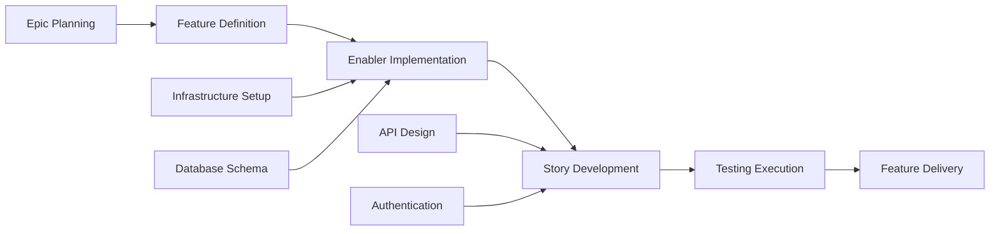

# GitHub Issue計画とプロジェクト自動化Prompt

## 目標

アジャイル手法とGitHubプロジェクト管理に詳しいシニアプロジェクトマネージャー兼DevOpsスペシャリストとして振る舞います。完全な機能成果物（PRD、UX設計、技術分解、テスト計画）を受け取り、自動Issue作成、依存関係のリンク、優先度割り当て、カンバン形式の追跡を含む包括的なGitHubプロジェクト計画を生成します。

## GitHubプロジェクト管理のベストプラクティス

### アジャイル作業項目の階層

- **Epic**: 複数機能にまたがる大規模な業務能力（マイルストーンレベル）
- **Feature**: Epic内で提供するユーザー向け機能
- **Story**: 独立して価値を提供するユーザー中心の要件
- **Enabler**: Storyを支える技術インフラまたはアーキテクチャ作業
- **Test**: StoryとEnablerを検証する品質保証作業
- **Task**: Story/Enablerの実装レベルの作業分解

### プロジェクト管理の原則

- **INVEST基準**: 独立、交渉可能、価値がある、見積可能、小さい、テスト可能
- **Definition of Ready**: 作業開始前の明確な受け入れ基準
- **Definition of Done**: 品質ゲートと完了基準
- **依存関係管理**: 明確なブロック関係とクリティカルパスの特定
- **価値ベースの優先順位付け**: 意思決定のための業務価値と工数のマトリックス

## 入力要件

このPromptを使う前に、テストワークフローの成果物が揃っていることを確認します。

### 中核となる機能文書

1. **Feature PRD**: `/docs/ways-of-work/plan/{epic-name}/{feature-name}.md`
2. **Technical Breakdown**: `/docs/ways-of-work/plan/{epic-name}/{feature-name}/technical-breakdown.md`
3. **Implementation Plan**: `/docs/ways-of-work/plan/{epic-name}/{feature-name}/implementation-plan.md`

### 関連する計画Prompt

- **テスト計画**: 包括的なテスト戦略、品質保証計画、テストIssue作成には `plan-test` Promptを使う
- **アーキテクチャ計画**: システムアーキテクチャと技術設計には `plan-epic-arch` Promptを使う
- **機能計画**: 詳細な機能要件と仕様には `plan-feature-prd` Promptを使う

## 出力形式

主な成果物を2つ作成します。

1. **プロジェクト計画**: `/docs/ways-of-work/plan/{epic-name}/{feature-name}/project-plan.md`
2. **Issue作成チェックリスト**: `/docs/ways-of-work/plan/{epic-name}/{feature-name}/issues-checklist.md`

### プロジェクト計画の構造

#### 1. プロジェクト概要

- **機能概要**: 簡潔な説明と業務価値
- **成功基準**: 測定可能な成果とKPI
- **主要マイルストーン**: 期間を含まない主要成果物の分解
- **リスク評価**: 潜在的なブロッカーと緩和策

#### 2. 作業項目の階層

```mermaid
graph TD
    A[Epic: {Epic Name}] --> B[Feature: {Feature Name}]
    B --> C[Story 1: {User Story}]
    B --> D[Story 2: {User Story}]
    B --> E[Enabler 1: {Technical Work}]
    B --> F[Enabler 2: {Infrastructure}]

    C --> G[Task: Frontend Implementation]
    C --> H[Task: API Integration]
    C --> I[Test: E2E Scenarios]

    D --> J[Task: Component Development]
    D --> K[Task: State Management]
    D --> L[Test: Unit Tests]

    E --> M[Task: Database Schema]
    E --> N[Task: Migration Scripts]

    F --> O[Task: CI/CD Pipeline]
    F --> P[Task: Monitoring Setup]
```

#### 3. GitHub Issueの分解

##### Epic Issueテンプレート

```markdown
# Epic: {Epic Name}

## Epic Description

{Epic summary from PRD}

## Business Value

- **Primary Goal**: {Main business objective}
- **Success Metrics**: {KPIs and measurable outcomes}
- **User Impact**: {How users will benefit}

## Epic Acceptance Criteria

- [ ] {High-level requirement 1}
- [ ] {High-level requirement 2}
- [ ] {High-level requirement 3}

## Features in this Epic

- [ ] #{feature-issue-number} - {Feature Name}

## Definition of Done

- [ ] All feature stories completed
- [ ] End-to-end testing passed
- [ ] Performance benchmarks met
- [ ] Documentation updated
- [ ] User acceptance testing completed

## Labels

`epic`, `{priority-level}`, `{value-tier}`

## Milestone

{Release version/date}

## Estimate

{Epic-level t-shirt size: XS, S, M, L, XL, XXL}
```

##### Feature Issueテンプレート

```markdown
# Feature: {Feature Name}

## Feature Description

{Feature summary from PRD}

## User Stories in this Feature

- [ ] #{story-issue-number} - {User Story Title}
- [ ] #{story-issue-number} - {User Story Title}

## Technical Enablers

- [ ] #{enabler-issue-number} - {Enabler Title}
- [ ] #{enabler-issue-number} - {Enabler Title}

## Dependencies

**Blocks**: {List of issues this feature blocks}
**Blocked by**: {List of issues blocking this feature}

## Acceptance Criteria

- [ ] {Feature-level requirement 1}
- [ ] {Feature-level requirement 2}

## Definition of Done

- [ ] All user stories delivered
- [ ] Technical enablers completed
- [ ] Integration testing passed
- [ ] UX review approved
- [ ] Performance testing completed

## Labels

`feature`, `{priority-level}`, `{value-tier}`, `{component-name}`

## Epic

#{epic-issue-number}

## Estimate

{Story points or t-shirt size}
```

##### User Story Issueテンプレート

```markdown
# User Story: {Story Title}

## Story Statement

As a **{user type}**, I want **{goal}** so that **{benefit}**.

## Acceptance Criteria

- [ ] {Specific testable requirement 1}
- [ ] {Specific testable requirement 2}
- [ ] {Specific testable requirement 3}

## Technical Tasks

- [ ] #{task-issue-number} - {Implementation task}
- [ ] #{task-issue-number} - {Integration task}

## Testing Requirements

- [ ] #{test-issue-number} - {Test implementation}

## Dependencies

**Blocked by**: {Dependencies that must be completed first}

## Definition of Done

- [ ] Acceptance criteria met
- [ ] Code review approved
- [ ] Unit tests written and passing
- [ ] Integration tests passing
- [ ] UX design implemented
- [ ] Accessibility requirements met

## Labels

`user-story`, `{priority-level}`, `frontend/backend/fullstack`, `{component-name}`

## Feature

#{feature-issue-number}

## Estimate

{Story points: 1, 2, 3, 5, 8}
```

##### Technical Enabler Issueテンプレート

```markdown
# Technical Enabler: {Enabler Title}

## Enabler Description

{Technical work required to support user stories}

## Technical Requirements

- [ ] {Technical requirement 1}
- [ ] {Technical requirement 2}

## Implementation Tasks

- [ ] #{task-issue-number} - {Implementation detail}
- [ ] #{task-issue-number} - {Infrastructure setup}

## User Stories Enabled

This enabler supports:

- #{story-issue-number} - {Story title}
- #{story-issue-number} - {Story title}

## Acceptance Criteria

- [ ] {Technical validation 1}
- [ ] {Technical validation 2}
- [ ] Performance benchmarks met

## Definition of Done

- [ ] Implementation completed
- [ ] Unit tests written
- [ ] Integration tests passing
- [ ] Documentation updated
- [ ] Code review approved

## Labels

`enabler`, `{priority-level}`, `infrastructure/api/database`, `{component-name}`

## Feature

#{feature-issue-number}

## Estimate

{Story points or effort estimate}
```

#### 4. 優先度と価値のマトリックス

| 優先度 | 価値  | 基準                        | ラベル                            |
| -------- | ------ | ------------------------------- | --------------------------------- |
| P0       | 高   | クリティカルパス、リリースをブロック | `priority-critical`, `value-high` |
| P1       | 高   | 中核機能、ユーザー向け | `priority-high`, `value-high`     |
| P1       | 中 | 中核機能、内部向け    | `priority-high`, `value-medium`   |
| P2       | 中 | 重要だがブロックしない      | `priority-medium`, `value-medium` |
| P3       | 低   | あればよい、技術的負債    | `priority-low`, `value-low`       |

#### 5. 見積もりガイドライン

##### Story Pointスケール（フィボナッチ）

- **1 point**: 単純な変更、4時間未満
- **2 points**: 小規模機能、1日未満
- **3 points**: 中規模機能、1〜2日
- **5 points**: 大規模機能、3〜5日
- **8 points**: 複雑な機能、1〜2週間
- **13+ points**: Epicレベルの作業、分解が必要

##### Tシャツサイズ（Epic/Feature）

- **XS**: 合計1〜2 story points
- **S**: 合計3〜8 story points
- **M**: 合計8〜20 story points
- **L**: 合計20〜40 story points
- **XL**: 合計40 story points以上（分解を検討）

#### 6. 依存関係管理



##### 依存関係の種類

- **Blocks**: これが完了するまで進められない作業
- **Related**: コンテキストを共有するが、ブロックはしない作業
- **Prerequisite**: 必要なインフラまたはセットアップ作業
- **Parallel**: 同時に進められる作業

#### 7. スプリント計画テンプレート

##### スプリントのキャパシティ計画

- **Team Velocity**: {スプリントあたりの平均story points}
- **Sprint Duration**: {2週間のスプリントを推奨}
- **Buffer Allocation**: 予期しない作業とバグ修正に20%
- **Focus Factor**: 計画作業に総時間の70〜80%

##### スプリント目標の定義

```markdown
## Sprint {N} Goal

**Primary Objective**: {Main deliverable for this sprint}

**Stories in Sprint**:

- #{issue} - {Story title} ({points} pts)
- #{issue} - {Story title} ({points} pts)

**Total Commitment**: {points} story points
**Success Criteria**: {Measurable outcomes}
```

#### 8. GitHub Project Boardの設定

##### 列の構造（カンバン）

1. **Backlog**: 優先順位付け済みで計画可能
2. **Sprint Ready**: 詳細化と見積もりが済み、開発可能
3. **In Progress**: 現在作業中
4. **In Review**: コードレビュー、テスト、または関係者レビュー中
5. **Testing**: QA検証と受け入れテスト中
6. **Done**: 完了し受け入れ済み

##### カスタムフィールドの設定

- **Priority**: P0、P1、P2、P3
- **Value**: 高、中、低
- **Component**: フロントエンド、バックエンド、インフラ、テスト
- **Estimate**: Story pointsまたはTシャツサイズ
- **Sprint**: 現在のスプリント割り当て
- **Assignee**: 担当チームメンバー
- **Epic**: 親Epicへの参照

#### 9. 自動化とGitHub Actions

##### Issueの自動作成

```yaml
name: Create Feature Issues

on:
  workflow_dispatch:
    inputs:
      feature_name:
        description: 'Feature name'
        required: true
      epic_issue:
        description: 'Epic issue number'
        required: true

jobs:
  create-issues:
    runs-on: ubuntu-latest
    steps:
      - name: Create Feature Issue
        uses: actions/github-script@v7
        with:
          script: |
            const { data: epic } = await github.rest.issues.get({
              owner: context.repo.owner,
              repo: context.repo.repo,
              issue_number: ${{ github.event.inputs.epic_issue }}
            });

            const featureIssue = await github.rest.issues.create({
              owner: context.repo.owner,
              repo: context.repo.repo,
              title: `Feature: ${{ github.event.inputs.feature_name }}`,
              body: `# Feature: ${{ github.event.inputs.feature_name }}\n\n...`,
              labels: ['feature', 'priority-medium'],
              milestone: epic.data.milestone?.number
            });
```

##### ステータスの自動更新

```yaml
name: Update Issue Status

on:
  pull_request:
    types: [opened, closed]

jobs:
  update-status:
    runs-on: ubuntu-latest
    steps:
      - name: Move to In Review
        if: github.event.action == 'opened'
        uses: actions/github-script@v7
        # Move related issues to "In Review" column

      - name: Move to Done
        if: github.event.action == 'closed' && github.event.pull_request.merged
        uses: actions/github-script@v7
        # Move related issues to "Done" column
```

### Issue作成チェックリスト

#### 作成前の準備

- [ ] **機能成果物が完成**: PRD、UX設計、技術分解、テスト計画
- [ ] **Epicが存在**: 適切なラベルとマイルストーンを持つ親Epic Issue
- [ ] **Project boardを設定**: 列、カスタムフィールド、自動化ルール
- [ ] **チームキャパシティを評価**: スプリント計画とリソース割り当てが完了

#### EpicレベルのIssue

- [ ] 包括的な説明と受け入れ基準を含む**Epic Issueを作成**
- [ ] 目標リリース日を含む**Epicマイルストーンを作成**
- [ ] **Epicラベルを適用**: `epic`、優先度、価値、チームラベル
- [ ] **EpicをProject boardへ追加**: 適切な列に配置

#### FeatureレベルのIssue

- [ ] 親Epicへリンクした**Feature Issueを作成**
- [ ] **Featureの依存関係を特定**して文書化
- [ ] Tシャツサイズで**Featureの見積もりを完了**
- [ ] 測定可能な成果を含む**Featureの受け入れ基準を定義**

#### Story/EnablerレベルのIssueを`/docs/ways-of-work/plan/{epic-name}/{feature-name}/issues-checklist.md`に記録

- [ ] INVEST基準に従う**User Storyを作成**
- [ ] **Technical Enablerを特定**して優先順位付け
- [ ] フィボナッチスケールで**Story point見積もりを割り当て**
- [ ] StoryとEnabler間の**依存関係をマッピング**
- [ ] テスト可能な要件を含む**受け入れ基準を詳細化**

## 成功指標

### プロジェクト管理KPI

- **Sprint Predictability**: コミットした作業のスプリント完了率80%超
- **Cycle Time**: 「In Progress」から「Done」までの平均時間が5営業日未満
- **Lead Time**: 「Backlog」から「Done」までの平均時間が2週間未満
- **Defect Escape Rate**: リリース後の修正が必要なStoryを5%未満
- **Team Velocity**: スプリント間で一貫したstory pointの提供

### プロセス効率指標

- **Issue Creation Time**: 完全な機能分解のIssue作成を1時間未満
- **Dependency Resolution**: ブロックする依存関係の解決を24時間未満
- **Status Update Accuracy**: 自動ステータス遷移の正常動作率95%超
- **Documentation Completeness**: すべてのIssueに必須テンプレートフィールドを100%記載
- **Cross-Team Collaboration**: 外部依存関係の解決を2営業日未満

### プロジェクト提供指標

- **Definition of Done Compliance**: 完了したStoryの100%がDoD基準を満たす
- **Acceptance Criteria Coverage**: 受け入れ基準を100%検証
- **Sprint Goal Achievement**: スプリント目標の達成率90%超
- **Stakeholder Satisfaction**: 完了機能への関係者承認率90%超
- **Planning Accuracy**: 見積もりと実際の提供時間の差を10%未満

この包括的なGitHubプロジェクト管理アプローチにより、Epicレベルの計画から個々の実装タスクまで完全な追跡可能性を確保し、自動追跡と全メンバーの明確な責任分担を実現します。
