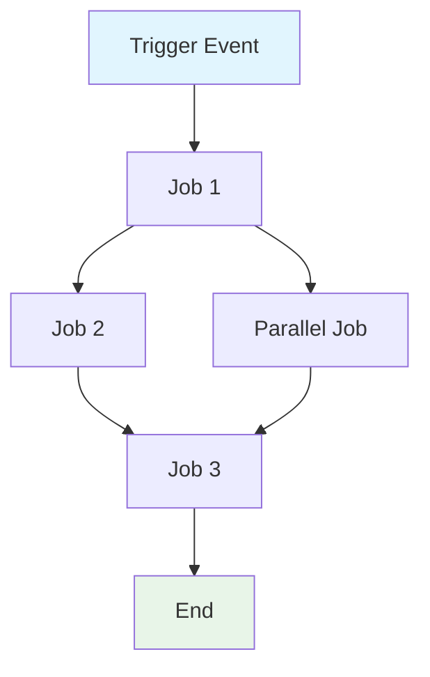
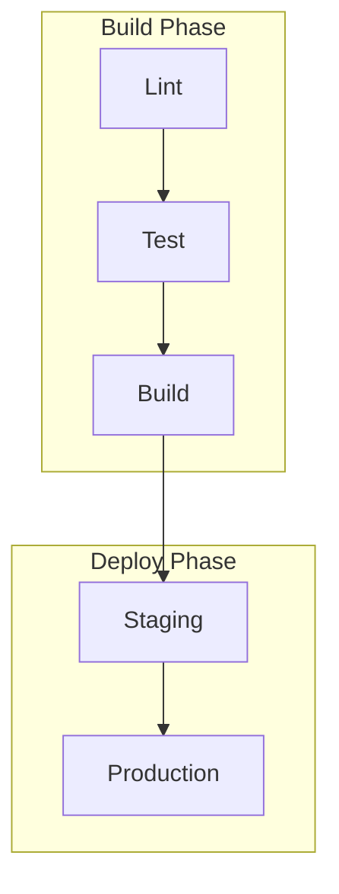

# GitHub Actions Workflow仕様の作成

GitHub Actions Workflow `${input:WorkflowFile}` の包括的な仕様を作成する。

この仕様は、Workflowの動作、要件、制約を定義する。実装方法ではなくWorkflowが達成する**内容**へ焦点を当て、実装に依存しないものにする。

## AI向けに最適化した要件

- **トークン効率**: 明確さを損なわず簡潔な言葉を使う
- **構造化データ**: 表、リスト、図を活用して情報を高密度に示す
- **意味の明確さ**: 全体を通して正確な用語を一貫して使う
- **実装の抽象化**: 特定の構文、コマンド、ツールバージョンを避ける
- **保守性**: Workflowの進化に合わせて容易に更新できるよう設計する

## 仕様テンプレート

保存先: `/spec/spec-process-cicd-[workflow-name].md`

```md
---
title: CI/CD Workflow Specification - [Workflow Name]
version: 1.0
date_created: [YYYY-MM-DD]
last_updated: [YYYY-MM-DD]
owner: DevOps Team
tags: [process, cicd, github-actions, automation, [domain-specific-tags]]
---

## Workflow Overview

**Purpose**: [One sentence describing workflow's primary goal]
**Trigger Events**: [List trigger conditions]
**Target Environments**: [Environment scope]

## Execution Flow Diagram



## Jobs & Dependencies

| Job Name | Purpose | Dependencies | Execution Context |
|----------|---------|--------------|-------------------|
| job-1 | [Purpose] | [Prerequisites] | [Runner/Environment] |
| job-2 | [Purpose] | job-1 | [Runner/Environment] |

## Requirements Matrix

### Functional Requirements
| ID | Requirement | Priority | Acceptance Criteria |
|----|-------------|----------|-------------------|
| REQ-001 | [Requirement] | High | [Testable criteria] |
| REQ-002 | [Requirement] | Medium | [Testable criteria] |

### Security Requirements
| ID | Requirement | Implementation Constraint |
|----|-------------|---------------------------|
| SEC-001 | [Security requirement] | [Constraint description] |

### Performance Requirements
| ID | Metric | Target | Measurement Method |
|----|-------|--------|-------------------|
| PERF-001 | [Metric] | [Target value] | [How measured] |

## Input/Output Contracts

### Inputs

```yaml
# Environment Variables
ENV_VAR_1: string  # Purpose: [description]
ENV_VAR_2: secret  # Purpose: [description]

# Repository Triggers
paths: [list of path filters]
branches: [list of branch patterns]
```

### Outputs

```yaml
# Job Outputs
job_1_output: string  # Description: [purpose]
build_artifact: file  # Description: [content type]
```

### Secrets & Variables

| Type | Name | Purpose | Scope |
|------|------|---------|-------|
| Secret | SECRET_1 | [Purpose] | Workflow |
| Variable | VAR_1 | [Purpose] | Repository |

## Execution Constraints

### Runtime Constraints

- **Timeout**: [Maximum execution time]
- **Concurrency**: [Parallel execution limits]
- **Resource Limits**: [Memory/CPU constraints]

### Environmental Constraints

- **Runner Requirements**: [OS/hardware needs]
- **Network Access**: [External connectivity needs]
- **Permissions**: [Required access levels]

## Error Handling Strategy

| Error Type | Response | Recovery Action |
|------------|----------|-----------------|
| Build Failure | [Response] | [Recovery steps] |
| Test Failure | [Response] | [Recovery steps] |
| Deployment Failure | [Response] | [Recovery steps] |

## Quality Gates

### Gate Definitions

| Gate | Criteria | Bypass Conditions |
|------|----------|-------------------|
| Code Quality | [Standards] | [When allowed] |
| Security Scan | [Thresholds] | [When allowed] |
| Test Coverage | [Percentage] | [When allowed] |

## Monitoring & Observability

### Key Metrics

- **Success Rate**: [Target percentage]
- **Execution Time**: [Target duration]
- **Resource Usage**: [Monitoring approach]

### Alerting

| Condition | Severity | Notification Target |
|-----------|----------|-------------------|
| [Condition] | [Level] | [Who/Where] |

## Integration Points

### External Systems

| System | Integration Type | Data Exchange | SLA Requirements |
|--------|------------------|---------------|------------------|
| [System] | [Type] | [Data format] | [Requirements] |

### Dependent Workflows

| Workflow | Relationship | Trigger Mechanism |
|----------|--------------|-------------------|
| [Workflow] | [Type] | [How triggered] |

## Compliance & Governance

### Audit Requirements

- **Execution Logs**: [Retention policy]
- **Approval Gates**: [Required approvals]
- **Change Control**: [Update process]

### Security Controls

- **Access Control**: [Permission model]
- **Secret Management**: [Rotation policy]
- **Vulnerability Scanning**: [Scan frequency]

## Edge Cases & Exceptions

### Scenario Matrix

| Scenario | Expected Behavior | Validation Method |
|----------|-------------------|-------------------|
| [Edge case] | [Behavior] | [How to verify] |

## Validation Criteria

### Workflow Validation

- **VLD-001**: [Validation rule]
- **VLD-002**: [Validation rule]

### Performance Benchmarks

- **PERF-001**: [Benchmark criteria]
- **PERF-002**: [Benchmark criteria]

## Change Management

### Update Process

1. **Specification Update**: Modify this document first
2. **Review & Approval**: [Approval process]
3. **Implementation**: Apply changes to workflow
4. **Testing**: [Validation approach]
5. **Deployment**: [Release process]

### Version History

| Version | Date | Changes | Author |
|---------|------|---------|--------|
| 1.0 | [Date] | Initial specification | [Author] |

## Related Specifications

- [Link to related workflow specs]
- [Link to infrastructure specs]
- [Link to deployment specs]

```

## 分析手順

Workflowファイルを分析するときは次に従う。

1. **中核目的の抽出**: 主なビジネス目標を特定する
2. **Jobフローの対応付け**: 実行順序を示す依存関係グラフを作成する
3. **契約の特定**: 入力、出力、インターフェイスを記録する
4. **制約の収集**: タイムアウト、権限、制限を抽出する
5. **品質ゲートの定義**: 検証点と承認点を特定する
6. **エラーパスの記録**: 失敗シナリオと復旧を対応付ける
7. **実装の抽象化**: 構文ではなく動作へ焦点を当てる

## Mermaid図の指針

### フローの種類
- **Sequential**: `A --> B --> C`
- **Parallel**: `A --> B & A --> C; B --> D & C --> D`
- **Conditional**: `A --> B{Decision}; B -->|Yes| C; B -->|No| D`

### スタイル
```mermaid
style TriggerNode fill:#e1f5fe
style SuccessNode fill:#e8f5e8
style FailureNode fill:#ffebee
style ProcessNode fill:#f3e5f5
```

### 複雑なWorkflow
5つ以上のJobがあるWorkflowではsubgraphを使う。


## トークン最適化戦略

1. **表を使う**: 構造化形式で情報を高密度に示す
2. **略語を一貫して使う**: 一度定義し、全体で使用する
3. **箇条書き**: 散文の段落を避ける
4. **コードブロック**: 文章より構造化データを優先する
5. **相互参照**: 情報を繰り返さずリンクする

文書とWorkflow更新用テンプレートの両方として機能する仕様の作成に集中する。
