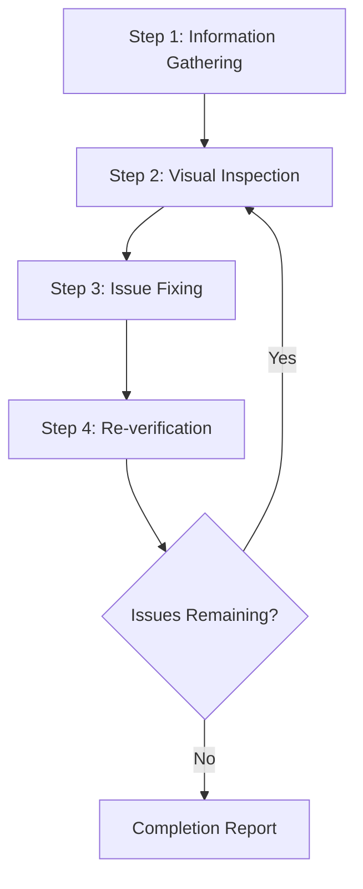
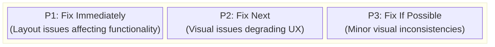
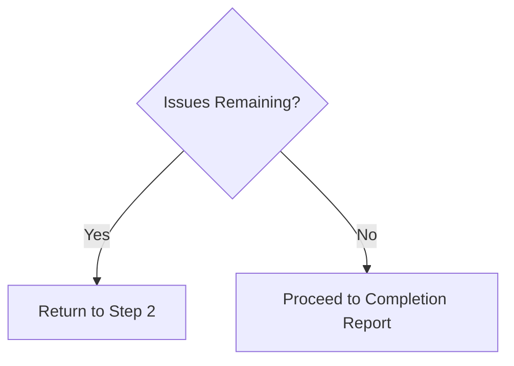

# Web デザインレビュアー

この Skill は Web サイトのデザイン品質を目視確認・検証し、ソースコードレベルで問題を特定・修正する。

## 適用範囲

- 静的サイト（HTML/CSS/JS）
- React / Vue / Angular / Svelte などの SPA フレームワーク
- Next.js / Nuxt / SvelteKit などのフルスタックフレームワーク
- WordPress / Drupal などの CMS プラットフォーム
- その他の Web アプリケーション

## 前提条件

### 必須

1. **対象 Web サイトが起動していること**
   - ローカル開発サーバー（例: `http://localhost:3000`）
   - ステージング環境
   - 本番環境（読み取り専用レビューの場合）

2. **ブラウザー自動化が利用できること**
   - スクリーンショット取得
   - ページナビゲーション
   - DOM 情報の取得

3. **ソースコードへアクセスできること（修正する場合）**
   - プロジェクトがワークスペース内に存在すること

## ワークフローの概要



---

## 手順 1: 情報収集フェーズ

### 1.1 URL の確認

URL が指定されていない場合は、ユーザーに次を尋ねる:

> レビュー対象 Web サイトの URL を指定してください（例: `http://localhost:3000`）。

### 1.2 プロジェクト構造の把握

修正する場合は、次の情報を収集する:

| 項目 | 質問例 |
|------|------------------|
| フレームワーク | React / Vue / Next.js などのどれを使っているか |
| スタイリング方法 | CSS / SCSS / Tailwind / CSS-in-JS など |
| ソースの場所 | スタイルファイルとコンポーネントはどこにあるか |
| レビュー範囲 | 特定ページだけか、サイト全体か |

### 1.3 プロジェクトの自動検出

ワークスペース内のファイルから自動検出を試みる:

```
Detection targets:
├── package.json     → Framework and dependencies
├── tsconfig.json    → TypeScript usage
├── tailwind.config  → Tailwind CSS
├── next.config      → Next.js
├── vite.config      → Vite
├── nuxt.config      → Nuxt
└── src/ or app/     → Source directory
```

### 1.4 スタイリング方法の特定

| 方法 | 検出 | 編集対象 |
|--------|-----------|-------------|
| Pure CSS | `*.css` ファイル | グローバル CSS またはコンポーネント CSS |
| SCSS/Sass | `*.scss`、`*.sass` | SCSS ファイル |
| CSS Modules | `*.module.css` | モジュール CSS ファイル |
| Tailwind CSS | `tailwind.config.*` | コンポーネント内の className |
| styled-components | コード内の `styled.` | JS/TS ファイル |
| Emotion | `@emotion/` の import | JS/TS ファイル |
| CSS-in-JS（その他） | インラインスタイル | JS/TS ファイル |

---

## 手順 2: 目視確認フェーズ

### 2.1 ページを巡回

1. 指定された URL に移動する。
2. スクリーンショットを取得する。
3. 可能であれば DOM 構造またはスナップショットを取得する。
4. 追加ページがある場合はナビゲーションをたどる。

### 2.2 確認項目

確認中と修正後の検証時に [references/visual-checklist.md](references/visual-checklist.md) を使う。

#### レイアウトの問題

| 問題 | 説明 | 重大度 |
|-------|-------------|----------|
| 要素のはみ出し | 親要素またはビューポートからコンテンツがはみ出す | 高 |
| 要素の重なり | 意図しない要素の重なり | 高 |
| 配置の問題 | Grid または flex の配置問題 | 中 |
| 不均一な間隔 | padding/margin の不一致 | 中 |
| テキストの切り取り | 長いテキストが適切に処理されない | 中 |

#### レスポンシブの問題

| 問題 | 説明 | 重大度 |
|-------|-------------|----------|
| モバイル非対応 | 小さい画面でレイアウトが崩れる | 高 |
| ブレークポイントの問題 | 画面サイズ変更時の不自然な遷移 | 中 |
| タッチ対象 | モバイルでボタンが小さすぎる | 中 |

#### アクセシビリティの問題

| 問題 | 説明 | 重大度 |
|-------|-------------|----------|
| コントラスト不足 | テキストと背景のコントラスト比が低い | 高 |
| フォーカス状態なし | キーボード操作時の状態を判断できない | 高 |
| alt テキストの欠落 | 画像に代替テキストがない | 中 |

#### 視覚的一貫性

| 問題 | 説明 | 重大度 |
|-------|-------------|----------|
| フォントの不一致 | フォントファミリが混在している | 中 |
| 色の不一致 | ブランドカラーが統一されていない | 中 |
| 間隔の不一致 | 類似要素間の間隔が均一でない | 低 |

### 2.3 ビューポートテスト（レスポンシブ）

次のビューポートでテストする:

| 名前 | 幅 | 代表的なデバイス |
|------|-------|----------------------|
| モバイル | 375px | iPhone SE/12 mini |
| タブレット | 768px | iPad |
| デスクトップ | 1280px | 標準 PC |
| ワイド | 1920px | 大画面ディスプレイ |

---

## 手順 3: 問題修正フェーズ

### 3.1 問題の優先順位付け



### 3.2 ソースファイルの特定

問題のある要素からソースファイルを特定する:

1. **セレクターによる検索**
   - クラス名または ID でコードベースを検索する。
   - `grep_search` でスタイル定義を調べる。

2. **コンポーネントによる検索**
   - 要素のテキストまたは構造からコンポーネントを特定する。
   - `semantic_search` で関連ファイルを調べる。

3. **ファイルパターンによる絞り込み**
   ```
   Style files: src/**/*.css, styles/**/*
   Components: src/components/**/*
   Pages: src/pages/**, app/**
   ```

### 3.3 修正を適用

#### フレームワーク別の修正指針

[詳細は [references/framework-fixes.md](references/framework-fixes.md) を参照する。]

#### 修正の原則

1. **最小限の変更**: 問題を解決するために必要な最小限の変更だけを行う。
2. **既存パターンの尊重**: プロジェクトの既存コードスタイルに従う。
3. **破壊的変更の回避**: 他の領域に影響を与えないよう注意する。
4. **コメントの追加**: 適切な場合は修正理由を説明するコメントを追加する。

---

## 手順 4: 再検証フェーズ

### 4.1 修正後の確認

1. ブラウザーを再読み込みする（または開発サーバーの HMR を待つ）。
2. 修正箇所のスクリーンショットを取得する。
3. 修正前と修正後を比較する。

### 4.2 回帰テスト

- 修正が他の領域に影響していないことを確認する。
- レスポンシブ表示が壊れていないことを確認する。

### 4.3 反復の判断



**反復回数の上限**: 特定の問題に3回を超える修正試行が必要な場合は、ユーザーに相談する。

---

## 出力形式

### レビュー結果レポート

```markdown
# Web Design Review Results

## Summary

| Item | Value |
|------|-------|
| Target URL | {URL} |
| Framework | {Detected framework} |
| Styling | {CSS / Tailwind / etc.} |
| Tested Viewports | Desktop, Mobile |
| Issues Detected | {N} |
| Issues Fixed | {M} |

## Detected Issues

### [P1] {Issue Title}

- **Page**: {Page path}
- **Element**: {Selector or description}
- **Issue**: {Detailed description of the issue}
- **Fixed File**: `{File path}`
- **Fix Details**: {Description of changes}
- **Screenshot**: Before/After

### [P2] {Issue Title}
...

## Unfixed Issues (if any)

### {Issue Title}
- **Reason**: {Why it was not fixed/could not be fixed}
- **Recommended Action**: {Recommendations for user}

## Recommendations

- {Suggestions for future improvements}
```

---

## 必須機能

| 機能 | 説明 | 必須 |
|------------|-------------|----------|
| Web ページナビゲーション | URL へのアクセス、ページ遷移 | ✅ |
| スクリーンショット取得 | ページ画像の取得 | ✅ |
| 画像分析 | 視覚的な問題の検出 | ✅ |
| DOM 取得 | ページ構造の取得 | 推奨 |
| ファイルの読み書き | ソースコードの読み取りと編集 | 修正に必須 |
| コード検索 | プロジェクト内のコード検索 | 修正に必須 |

---

## 参照実装

### Playwright MCP による実装

[Playwright MCP](https://github.com/microsoft/playwright-mcp) をこの Skill の参照実装として推奨する。

| 機能 | Playwright MCP ツール | 目的 |
|------------|---------------------|---------|
| ナビゲーション | `browser_navigate` | URL にアクセス |
| スナップショット | `browser_snapshot` | DOM 構造を取得 |
| スクリーンショット | `browser_take_screenshot` | 目視確認用の画像 |
| クリック | `browser_click` | インタラクティブ要素を操作 |
| サイズ変更 | `browser_resize` | レスポンシブテスト |
| コンソール | `browser_console_messages` | JS エラーを検出 |

#### 構成例（MCP Server）

```json
{
  "mcpServers": {
    "playwright": {
      "command": "npx",
      "args": ["-y", "@playwright/mcp@latest", "--caps=vision"]
    }
  }
}
```

### その他の互換ブラウザー自動化ツール

| ツール | 機能 |
|------|----------|
| Selenium | 幅広いブラウザーと多言語をサポート |
| Puppeteer | Chrome/Chromium に特化、Node.js |
| Cypress | E2E テストとの統合が容易 |
| WebDriver BiDi | 標準化された次世代プロトコル |

同じワークフローをこれらのツールで実装できる。必要な機能（ナビゲーション、スクリーンショット、DOM 取得）があれば、ツールの選択は柔軟である。

---

## ベストプラクティス

### 推奨事項

- ✅ 修正前に必ずスクリーンショットを保存する。
- ✅ 一度に1つの問題を修正し、それぞれ検証する。
- ✅ プロジェクトの既存コードスタイルに従う。
- ✅ 大きな変更の前にユーザーへ確認する。
- ✅ 修正内容を詳しく記録する。

### 非推奨事項

- ❌ 確認なしに大規模リファクタリングを行う。
- ❌ デザインシステムやブランドガイドラインを無視する。
- ❌ パフォーマンスを無視した修正を行う。
- ❌ 複数の問題を同時に修正する（検証が難しくなる）。

---

## トラブルシューティング

### 問題: スタイルファイルが見つからない

1. `package.json` の依存関係を確認する。
2. CSS-in-JS の可能性を検討する。
3. ビルド時に生成される CSS の可能性を検討する。
4. ユーザーにスタイリング方法を尋ねる。

### 問題: 修正が反映されない

1. 開発サーバーの HMR が動作しているか確認する。
2. ブラウザーキャッシュを消去する。
3. プロジェクトでビルドが必要なら再ビルドする。
4. CSS の詳細度の問題を確認する。

### 問題: 修正が他の領域に影響する

1. 変更をロールバックする。
2. より具体的なセレクターを使う。
3. CSS Modules またはスコープ付きスタイルの利用を検討する。
4. 影響範囲を確認するためユーザーに相談する。
